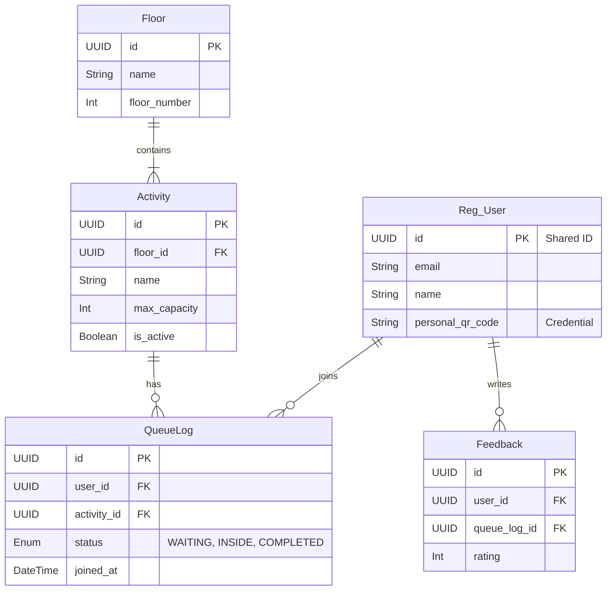

# Entity Relationship Diagram (ERD)

This document outlines the database schema for the Arduino Day PH 2025 Activity Map.

## Quick Links

- **[View Interactive Diagram on dbdiagram.io](https://dbdiagram.io/d/Activity-Map-ERD-6953781339fa3db27bca19fe)**
- **[View Database Dashboard (Supabase)](https://supabase.com/dashboard/project/YOUR_PROJECT_ID)**

---

## Visual Schema

> *Note: This schema includes the shared `User` table from the Registration System.*

---

## Schema Details (Mermaid)

For quick reference directly in GitHub/VS Code:

