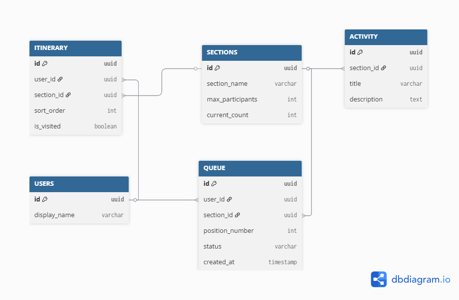

# Entity Relationship Diagram (ERD)

This schema models a **Capacity-Limited Queuing System** with itinerary support.

## Quick Links

- **[View Interactive Diagram on dbdiagram.io](https://dbdiagram.io/d/Activity-Map-ERD-6953781339fa3db27bca19fe)**
- **[View Database Dashboard (Supabase)(WIP)](https://supabase.com/dashboard/project/YOUR_PROJECT_ID)**

---

## Visual Schema



> *Note: This schema includes the shared `User` table from the Registration System.*

---

## Schema Details (Mermaid)

For quick reference directly in GitHub/VS Code:

```mermaid
erDiagram
    %% SHARED TABLE (From Registration)
    USERS {
        UUID id PK "Shared ID"
        String display_name
        String personal_qr_code "Identity Token"
    }

    %% VENUE MANAGEMENT
    SECTIONS {
        UUID id PK
        String section_name "e.g., 'Robotics Floor'"
        Int max_participants "Hard limit"
        Int current_count "Live census"
    }

    ACTIVITY {
        UUID id PK
        UUID section_id FK
        String title
        String description
    }

    %% QUEUE & ITINERARY LOGIC
    ITINERARY {
        UUID id PK
        UUID user_id FK
        UUID section_id FK
        Int sort_order "Planned sequence"
        Boolean is_visited
    }

    QUEUE {
        UUID id PK
        UUID user_id FK
        UUID section_id FK
        Int position_number
        Enum status "WAITING, NOTIFIED, INSIDE, FINISHED, CANCELLED"
        DateTime created_at
    }

    %% RELATIONSHIPS
    SECTIONS ||--|{ ACTIVITY : "hosts"
    SECTIONS ||--o{ ITINERARY : "is_destination"
    SECTIONS ||--o{ QUEUE : "has_waitlist"
    
    USERS ||--o{ ITINERARY : "plans"
    USERS ||--o{ QUEUE : "waits_in"