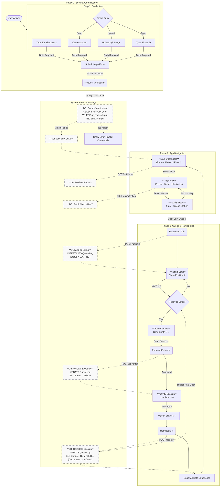

# Application Flowchart

This diagram illustrates the user journey from the "Secure Login" phase through the entire "Queue Lifecycle".

```mermaid
flowchart TD
    %% --- Section 1: Robust Auth Layer (Secure Entry) ---
    subgraph AuthLayer [Phase 1: Secure Authentication]
        direction TB
        User([User Arrives]) --> InputStep
        
        subgraph InputStep [Step 1: Credentials]
            direction TB
            InputEmail[Type Email Address]
            
            ScanOption{Ticket Entry}
            ScanOption -->|Scan| CamAuth[Camera Scan]
            ScanOption -->|Upload| FileAuth[Upload QR Image]
            ScanOption -->|Type| ManualAuth[Type Ticket ID]
        end
        
        InputEmail & CamAuth & FileAuth & ManualAuth -->|Both Required| SubmitLogin[Submit Login Form]
        SubmitLogin -->|POST /api/login| VerifyReq(Request Verification)
    end

    %% --- Section 2: Navigation (Dynamic Content) ---
    subgraph Navigation [Phase 2: App Navigation]
        Dashboard["**Main Dashboard**<br/>(Render List of N Floors)"] 
        FloorMap["**Floor View**<br/>(Render List of N Activities)"]
        ActDetail["**Activity Detail**<br/>(Info + Queue Status)"]

        Dashboard -->|Select Floor| FloorMap
        FloorMap -->|Select Activity| ActDetail
        ActDetail -- "Back to Map" --> FloorMap
    end

    %% --- Section 3: The Queue Lifecycle (User Actions) ---
    subgraph QueueLogic [Phase 3: Queue & Participation]
        ActDetail -->|Click 'Join Queue'| JoinReq(Request to Join)
        
        JoinReq --> InQueue("**Waiting State**<br/>Show Position #")
        InQueue -->|My Turn?| ScanAction{Ready to Enter?}
        
        ScanAction -- No --> InQueue
        ScanAction -- Yes --> CamOpen["**Open Camera**<br/>Scan Booth QR"]
        
        CamOpen -->|Scan Success| EnterReq(Request Entrance)
        EnterReq -->|Approved| Active["**Activity Session**<br/>User is Inside"]
        
        Active -->|Finished?| ExitScan["**Scan Exit QR**"]
        ExitScan --> ExitReq(Request Exit)
        ExitReq --> Rating[Optional: Rate Experience]
        Rating --> Dashboard
    end

    %% --- Section 4: System & Database (Backend Logic) ---
    subgraph SystemDB [System & DB Operations]
        direction TB
        
        %% 1. AUTH CHECK
        VerifyReq -.->|Query User Table| DB_Auth["**DB: Secure Verification**<br/>SELECT * FROM User<br/>WHERE qr_code = Input<br/>AND email = Input"]
        DB_Auth -.->|Match Found| SetCookie["**Set Session Cookie**"]
        SetCookie -.-> Dashboard
        DB_Auth -.->|No Match| LoginRetry[Show Error: Invalid Credentials]

        %% 2. DATA FETCHING
        Dashboard -.->|GET /api/floors| DB_FetchFloors["**DB: Fetch N Floors**"]
        FloorMap -.->|GET /api/activities| DB_FetchActs["**DB: Fetch N Activities**"]

        %% 3. QUEUE TRANSACTIONS
        JoinReq -.->|POST /api/join| DB_Add["**DB: Add to Queue**<br/>INSERT INTO QueueLog<br/>(Status = WAITING)"]
        DB_Add -.-> InQueue

        EnterReq -.->|POST /api/enter| DB_Enter["**DB: Validate & Update**<br/>UPDATE QueueLog<br/>SET Status = INSIDE"]
        DB_Enter -.-> Active

        ExitReq -.->|POST /api/exit| DB_Exit["**DB: Complete Session**<br/>UPDATE QueueLog<br/>SET Status = COMPLETED<br/>(Decrement Live Count)"]
        DB_Exit -.->|Trigger Next User| ScanAction
        DB_Exit -.-> Rating
    end

    %% Styling
    classDef dbOp fill:#f9f9f9,stroke:#333,stroke-dasharray: 5 5;
    class DB_Auth,DB_FetchFloors,DB_FetchActs,DB_Add,DB_Enter,DB_Exit,SetCookie dbOp;
```
